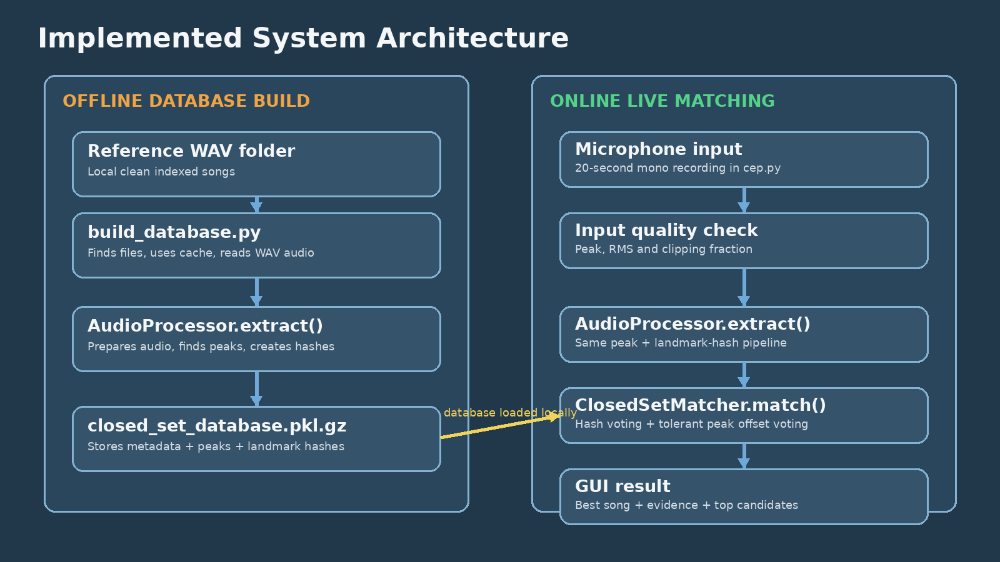
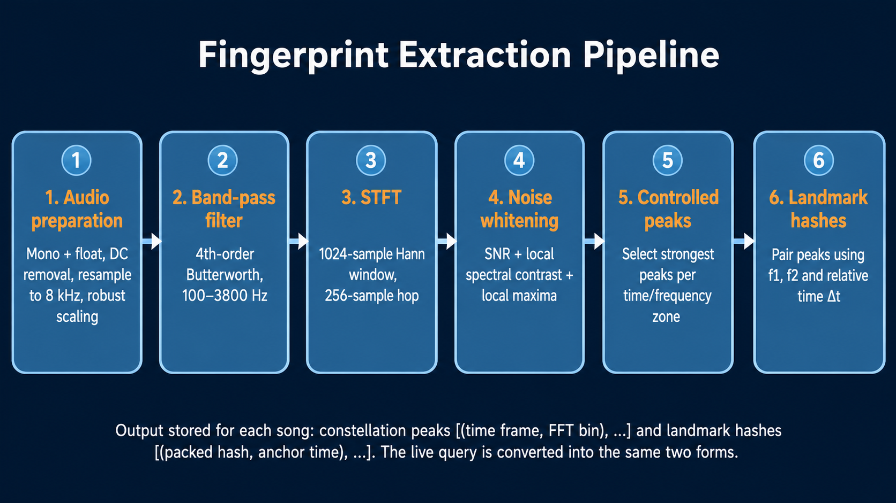

# Real-Time Audio Retrieval System Using Audio Fingerprinting and DSP

## Overview

This project implements a real-time audio retrieval system that identifies audio samples by extracting signal features and comparing them with a pre-generated fingerprint database.

The system follows a two-stage approach:

1. Offline fingerprint database generation
2. Real-time audio query and matching

In the offline stage, reference audio files are processed to generate fingerprints that are stored in a database. During the online stage, live audio is captured through a microphone, processed using digital signal processing techniques, and compared with stored fingerprints to identify the closest match.

The project demonstrates practical applications of Digital Signal Processing (DSP), audio feature extraction, similarity measurement, and real-time signal processing using Python.

---

## Features

- Real-time microphone audio capture
- Audio fingerprint generation
- DSP-based feature extraction
- Similarity-based audio matching
- Confidence-based match evaluation
- Audio waveform visualization
- Spectrogram visualization
- Graphical User Interface (GUI)
- Fingerprint database generation and management
- Match history tracking

---

## System Architecture




```

Reference Audio Files
          |
          v
  Feature Extraction
          |
          v
 Audio Fingerprint Database
          |
          |
          v
 Live Microphone Input
          |
          v
 Real-Time Signal Processing
          |
          v
 Similarity Comparison
          |
          v
 Retrieved Audio Result
```

---

## Project Structure

```
real-time-audio-retrieval-system/

│
├── cep.py
│   └── Main GUI application for real-time audio retrieval
│
├── dsp_core.py
│   └── Core DSP functions, feature extraction, and matching algorithms
│
├── build_database.py
│   └── Generates the audio fingerprint database
│
├── diagnose_db.py
│   └── Database checking and diagnostic utility
│
├── reindex.py
│   └── Utility for rebuilding fingerprint indexes
│
├── requirements.txt
│   └── Required Python packages
│
└── README.md
```

---

# Technologies Used

## Programming Language

- Python

## Libraries

- NumPy
- SciPy
- Matplotlib
- Sounddevice
- Tkinter

## Concepts Applied

- Digital Signal Processing
- Audio Fingerprinting
- Feature Extraction
- Pattern Recognition
- Similarity Matching
- Real-Time Signal Processing
- GUI Development

---

# Working Principle

## 1. Fingerprint Database Generation

Reference audio files are processed before real-time identification.

The system extracts important signal characteristics from the audio files and stores them as fingerprints. These fingerprints are later used for comparison with live audio input.

---

## 2. Real-Time Audio Acquisition

The system records audio input through a microphone.

The captured signal is processed to extract features that can be compared with the stored fingerprint database.

---

## 3. Feature Extraction

The audio signal is converted into numerical features that represent important characteristics of the sound.

These extracted features provide a compact representation of the audio signal and allow efficient comparison.

---

## 4. Matching Process

The features extracted from the live audio are compared with the stored fingerprints.

The system calculates similarity values and selects the closest matching audio sample.

---

# DSP Techniques Used

## Audio Fingerprinting

Audio fingerprinting creates a compact representation of an audio signal.

Instead of comparing complete audio files, the system compares extracted signal features, which improves efficiency and reduces computational requirements.

---

## Feature Extraction

Digital signal processing methods are used to transform raw audio signals into meaningful numerical representations.

These features allow different audio samples to be compared based on their signal characteristics.

---

## Similarity-Based Matching

The extracted features are compared using similarity measurements to determine the closest matching audio sample.

---

# Installation

Clone the repository:

```bash
git clone https://github.com/your-username/real-time-audio-retrieval-system.git
```

Navigate to the project directory:

```bash
cd real-time-audio-retrieval-system
```

Install required dependencies:

```bash
pip install -r requirements.txt
```

---

# Running the Project

## Step 1: Generate Fingerprint Database

Run:

```bash
python build_database.py
```

This creates the fingerprint database from the reference audio files.

---

## Step 2: Launch the Application

Run:

```bash
python cep.py
```

The GUI application will start and allow real-time audio input and matching.

---

# Applications

This type of system can be applied in:

- Music identification systems
- Audio search engines
- Content-based audio retrieval
- Multimedia databases
- Signal processing applications
- Sound recognition systems

---

# Learning Outcomes

This project provided practical experience in:

- Digital signal processing implementation
- Real-time audio analysis
- Feature extraction techniques
- Similarity-based retrieval algorithms
- Python-based engineering applications
- GUI development for signal processing systems

---

# Future Improvements

Possible improvements include:

- Improved noise resistance
- Larger audio database support
- Faster matching algorithms
- Cloud-based audio retrieval
- Mobile application integration

---

# Author

Mohammad Asiful Islam

---

# License

This project is licensed under the MIT License.
